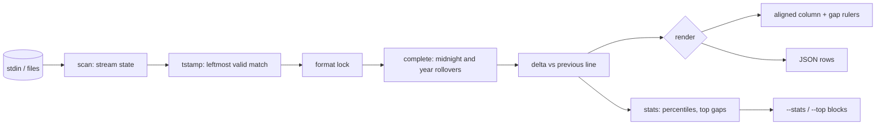

# gapline

[English](README.md) | [中文](README.zh.md) | [日本語](README.ja.md)

[](LICENSE) [](go.mod) [](CHANGELOG.md)  [](CONTRIBUTING.md)

**gapline：あらゆるログストリームの時間の空白をハイライトする、オープンソースで依存ゼロのパイプフィルタ —— タイムスタンプ形式の自動検出と相対デルタ表示で、あの 4 秒がどこへ消えたか一瞬でわかる。**


```bash
git clone https://github.com/JaydenCJ/gapline && cd gapline
go build -o gapline ./cmd/gapline    # single static binary, stdlib only
```

> プレリリース：v0.1.0 はまだどのパッケージレジストリにも公開されていません。上記のとおりソースからビルドしてください（Go ≥1.22 であれば可）。

## なぜ gapline？

パフォーマンス調査はタイムスタンプを凝視することから始まります。25ms 間隔の 2 行の次に 4 秒間隔の 2 行があり、事故の核心は頭の中で繰り返すその引き算に隠れています。既存ツールは肝心な瞬間に役立ちません。`lnav` は優秀なログ*ブラウザ*ですが、インストールして設定して操作する全画面 TUI であり、深夜 2 時に壊れたパイプラインで `kubectl logs -f` の後ろへ気軽に挿すものではありません。moreutils の `ts -i` は行間デルタを出しますが、それは*到着*時刻のデルタです。ライブでしか使えず、アプリではなく端末を測ってしまい、昨夜の障害ファイルに既に書かれているタイムスタンプのことは何も知りません。gapline はその中間を埋めます。9 種類のタイムスタンプ形式のどれかを自動検出し（暦の検証付きなのでチケット番号は時刻扱いされません）、各行に直前行からのデルタを付け、すべての空白に定規線を引くパイプフィルタです —— ライブストリームでも保存済みファイルでも使え、スクロールの代わりに要約が欲しいときはパーセンタイルと上位 N 空白レポートも出せます。

| | gapline | lnav | ts -i (moreutils) | awk + 暗算 |
|---|---|---|---|---|
| ログ自身のタイムスタンプを解析 | ✅ 9 形式・検証付き | ✅ | ❌ 到着時刻のみ | 正規表現は自作 |
| 行内の相対デルタ + 空白の定規線 | ✅ | ❌ 閲覧・調査型 | デルタのみ、定規なし | ❌ |
| 事故後に保存済みファイルへ適用 | ✅ | ✅ | ❌ ライブのみ | ✅ |
| 素のパイプフィルタ（`tail -f`、`kubectl logs`、CI） | ✅ | ❌ 全画面 TUI | ✅ | ✅ |
| 不完全タイムスタンプの日付・年またぎ補完 | ✅ 決定的 | ✅ | n/a | ❌ |
| パーセンタイル + 上位 N 空白 + JSON 行 | ✅ | 一部 | ❌ | ❌ |
| ランタイム依存 | 0 | ncurses、sqlite3、pcre2 など | perl | 0 |

<sub>依存数は 2026-07-13 に確認：gapline は Go 標準ライブラリのみを import。lnav 0.12 は ncurses、sqlite3、pcre2、libarchive などをリンクします。</sub>

## 特長

- **9 形式を自動検出** —— RFC 3339（ドット/カンマ小数・任意オフセット）、Python logging の ISO、Go `log`、Apache/nginx CLF、syslog、glog/klog、dmesg、10/13/16/19 桁 epoch、時刻のみの表記。最も左の有効一致が勝ち、ストリームは形式をロックするので本文中の引用時刻で検出が揺れません。
- **暦を検証するマッチング** —— 13 月、25 時、2000-2099 の範囲外の epoch は拒否して走査を続行。チケット番号やリクエスト ID がタイムスタンプになることはありません。
- **決定的なロールオーバー補完** —— 年なし syslog の年またぎも、時刻のみ表記の日付またぎも、ストリーム内の順序だけで正しく補完。gapline はシステム時計を一切読まないため、同一入力はバイト単位で同一の出力になります。
- **正直な負値** —— 小さな逆行（交錯した書き込み、クロックずれ）はシアンの負デルタとしてそのまま表示し、「修正」しません。
- **本物のフィルタ** —— 各行はバッファなしで流れ、デルタ列は整列。タイムスタンプのない継続行（スタックトレース）は空欄で素通し。`tail -f` にも昨日の障害ファイルにも同じように効きます。
- **必要なときだけ要約** —— `--stats` は p50/p90/p99・スパン・空白合計を表示。`--top n` は最大 n 個の空白を行番号付きで引用。`--json` は CI ゲート向けに 1 行 1 レコードの機械可読出力。
- **依存ゼロ・完全オフライン** —— Go 標準ライブラリのみ。テレメトリなし、ネットワークなし、永久に。`go.mod` の require は空のまま維持されます。

## クイックスタート

```bash
gapline -t 1s examples/api-server.log        # or: kubectl logs api | gapline -t 1s
```

実際にキャプチャした出力：

```text
     +0s │ 2026-07-12T14:03:22.120Z INFO  http GET /api/users 200 12ms
 +25.0ms │ 2026-07-12T14:03:22.145Z INFO  http GET /api/orders 200 9ms
 +16.0ms │ 2026-07-12T14:03:22.161Z INFO  cache hit users:list
 +29.0ms │ 2026-07-12T14:03:22.190Z INFO  http GET /api/accounts/9 200 4ms
 +24.0ms │ 2026-07-12T14:03:22.214Z INFO  http POST /api/login 201 22ms
──── gap 1.316s ──────────────────────────────
 +1.316s │ 2026-07-12T14:03:23.530Z WARN  pool connection pool exhausted, waiting
 +12.0ms │ 2026-07-12T14:03:23.542Z INFO  http GET /api/health 200 1ms
 +19.0ms │ 2026-07-12T14:03:23.561Z INFO  http GET /api/orders 200 8ms
──── gap 4.020s ──────────────────────────────
 +4.020s │ 2026-07-12T14:03:27.581Z ERROR upstream billing-svc timed out after 4s
         │   retrying with backoff (attempt 1/3)
 +31.0ms │ 2026-07-12T14:03:27.612Z INFO  http POST /api/checkout 502 4031ms
 +18.0ms │ 2026-07-12T14:03:27.630Z INFO  http GET /api/users 200 11ms
 +25.0ms │ 2026-07-12T14:03:27.655Z INFO  http GET /api/orders 200 7ms
```

要約も追加できる —— `gapline -t 1s --stats --top 2 examples/api-server.log` は上のストリームの後にこれらのブロックを付け足す（実出力の要約部分）：

```text
── top 2 gaps ────────────────────────────────
 +4.020s  line 9      2026-07-12T14:03:27.581Z ERROR upstream billing-svc timed o…
 +1.316s  line 6      2026-07-12T14:03:23.530Z WARN  pool connection pool exhaust…
── gapline stats ─────────────────────────────
lines            13 (12 timestamped, 1 without)
format           rfc3339
span             5.535s
p50 / p90 / p99  25.0ms / 1.316s / 4.020s
max delta        +4.020s (line 9)
gaps ≥ 1.000s    2 (total 5.336s)
```

年なし syslog が大晦日の深夜 0 時をまたぐ例 —— ロールオーバーはストリーム順序だけから推定されます（`gapline -t 10s examples/worker-restart.log`、実出力）：

```text
     +0s │ Dec 31 23:59:55 host worker[212]: draining queue (3 jobs left)
 +3.000s │ Dec 31 23:59:58 host worker[212]: queue empty, checkpointing
──── gap 33.0s ───────────────────────────────
  +33.0s │ Jan  1 00:00:31 host worker[212]: checkpoint complete
 +1.000s │ Jan  1 00:00:32 host systemd[1]: worker.service: scheduled restart
 +1.000s │ Jan  1 00:00:33 host worker[213]: started, resuming from checkpoint
```

## タイムスタンプ形式

検出は最左一致 + 暦検証 + ストリームごとのロック方式です —— 完全な仕様は [docs/formats.md](docs/formats.md) にあります。

| 形式 | 例 | 備考 |
|---|---|---|
| `rfc3339` | `2026-07-12T14:03:22.123Z` | ISO 8601。`.`/`,` 小数、オフセット任意 |
| `iso-space` | `2026-07-12 14:03:22,123` | Python `logging` の既定 |
| `slash` | `2026/07/12 14:03:22` | Go 標準ライブラリ `log` の既定 |
| `clf` | `[12/Jul/2026:14:03:22 +0900]` | Apache / nginx アクセスログ |
| `syslog` | `Jul 12 14:03:22` | RFC 3164。年なし、またぎは推定 |
| `klog` | `I0712 14:03:22.123456` | glog / klog ヘッダ。年なし |
| `dmesg` | `[   12.345678]` | カーネルの起動後経過秒 |
| `epoch` | `1752328402.123` | 10/13/16/19 桁 = 秒/ミリ/マイクロ/ナノ秒。範囲ガード付き |
| `time-only` | `14:03:22.123` | 時刻のみ。日付またぎは推定 |

## CLI リファレンス

`gapline [flags] [file ...]` —— ファイル指定がなければ stdin を読みます（`-` も stdin）。終了コード：0 正常、1 タイムスタンプ未検出、2 使用法または I/O エラー。

| フラグ | 既定値 | 効果 |
|---|---|---|
| `-t, --threshold` | `1s` | この値以上のデルタに定規線を引き赤くする |
| `-f, --format` | 自動検出 | タイムスタンプ形式を強制指定（`--list-formats` 参照） |
| `-s, --since-start` | オフ | 最初のタイムスタンプからの経過時間を表示 |
| `-b, --bars` | オフ | 1-2-5 の階段による対数スケールのバー列 |
| `--top` | オフ | ストリーム終了後、最大 n 個の空白を表示 |
| `--stats` | オフ | ストリーム終了後、p50/p90/p99・スパン・空白合計を表示 |
| `--no-markers` | オフ | 空白の定規線を出さない |
| `--json` | オフ | 入力 1 行につき JSON 1 行（`ts`、`delta_ms`、`gap` など） |
| `--color` | `auto` | `always` / `never`。auto は TTY のみ着色、`NO_COLOR` 尊重 |
| `--list-formats` | — | 対応タイムスタンプ形式を一覧して終了 |

## 検証

このリポジトリは CI を持ちません。上記の主張はすべてローカル実行で検証されます：

```bash
go test ./...            # 90 deterministic tests, offline, < 5 s
bash scripts/smoke.sh    # end-to-end CLI check, prints SMOKE OK
```

## アーキテクチャ



## ロードマップ

- [x] v0.1.0 —— 検証とロック付きの 9 形式自動検出、空白定規付きデルタ列、決定的ロールオーバー、`--stats`/`--top`/`--json`/`--bars`/`--since-start`、90 テスト + スモークスクリプト
- [ ] `--only-gaps` モード：空白と前後 n 行の文脈だけを表示
- [ ] ストリーム自身のデルタ分布からのしきい値自動決定
- [ ] 12 時間表記（`AM`/`PM`）とロケール月名
- [ ] マルチライタモード：フィールド（pid、pod）ごとに別トラックでデルタ計算
- [ ] `--stats` にデルタ分布のヒストグラム sparkline を追加

完全な一覧は [open issues](https://github.com/JaydenCJ/gapline/issues) を参照してください。

## コントリビュート

Issue・ディスカッション・PR を歓迎します —— ローカルの手順（フォーマット、vet、テスト、`SMOKE OK`）は [CONTRIBUTING.md](CONTRIBUTING.md) へ。入門タスクには [good first issue](https://github.com/JaydenCJ/gapline/issues?q=is%3Aissue+is%3Aopen+label%3A%22good+first+issue%22) のラベルがあり、設計の議論は [Discussions](https://github.com/JaydenCJ/gapline/discussions) で行っています。

## ライセンス

[MIT](LICENSE)
