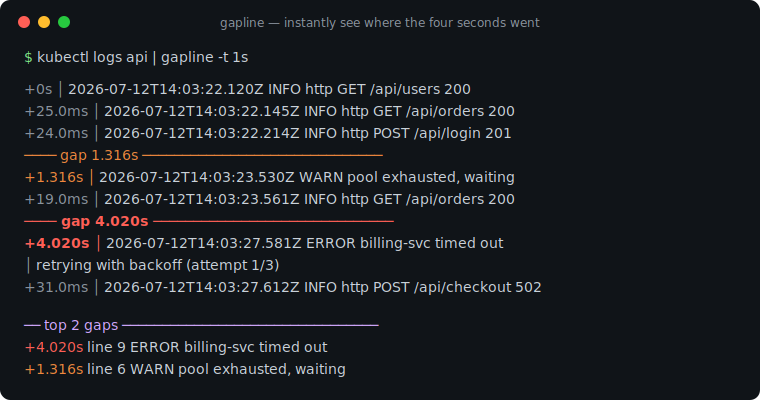
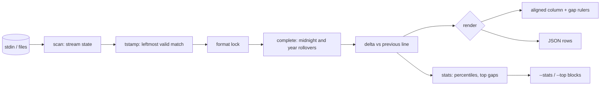

# gapline

[English](README.md) | [中文](README.zh.md) | [日本語](README.ja.md)

[](LICENSE) [](go.mod) [](CHANGELOG.md)  [](CONTRIBUTING.md)

**gapline：an open-source, zero-dependency pipe filter that highlights time gaps in any log stream — timestamp-format autodetection plus relative-delta rendering, so you instantly see where the four seconds went.**



```bash
git clone https://github.com/JaydenCJ/gapline && cd gapline
go build -o gapline ./cmd/gapline    # single static binary, stdlib only
```

> Pre-release: v0.1.0 is not tagged on a package registry yet; build from source as above (any Go ≥1.22).

## Why gapline?

Perf debugging starts with staring at timestamps: two log lines 25ms apart, then two lines 4 seconds apart, and the whole incident is hiding in that subtraction you keep doing in your head. The existing tools don't help at the moment it matters. `lnav` is a capable log *browser*, but it is a full-screen TUI you install, configure and navigate — not something you drop after `kubectl logs -f` in a broken pipeline at 2am. moreutils' `ts -i` prints inter-line deltas, but of *arrival* time: it only works live, measures your terminal instead of the application, and knows nothing about the timestamps already sitting in the file from last night's incident. gapline is the missing middle: a pipe filter that autodetects which of nine timestamp formats a stream uses (validating the calendar so ticket numbers don't count), prefixes every line with the delta since the previous one, and draws a ruler through every gap — on live streams and on saved files alike, with percentiles and a top-N gap report when you want the summary instead of the scroll.

| | gapline | lnav | ts -i (moreutils) | awk + mental math |
|---|---|---|---|---|
| Parses the log's own timestamps | ✅ 9 formats, validated | ✅ | ❌ arrival time only | you write the regex |
| Inline relative deltas + gap rulers | ✅ | ❌ browse-and-inspect | deltas, no rulers | ❌ |
| Works on saved files after the incident | ✅ | ✅ | ❌ live only | ✅ |
| Plain pipe filter (`tail -f`, `kubectl logs`, CI) | ✅ | ❌ full-screen TUI | ✅ | ✅ |
| Midnight / New Year rollover on partial timestamps | ✅ deterministic | ✅ | n/a | ❌ |
| Percentiles + top-N gaps + JSON rows | ✅ | partial | ❌ | ❌ |
| Runtime dependencies | 0 | ncurses, sqlite3, pcre2, … | perl | 0 |

<sub>Dependency counts checked 2026-07-13: gapline imports the Go standard library only; lnav 0.12 links ncurses, sqlite3, pcre2, libarchive and more.</sub>

## Features

- **Nine formats, autodetected** — RFC 3339 (dot/comma fractions, any offset), Python-logging ISO, Go `log`, Apache/nginx CLF, syslog, glog/klog, dmesg, 10/13/16/19-digit epochs, bare wall clocks. Leftmost valid match wins; the stream locks on so payload text can't flap it.
- **Calendar-validated matching** — month 13, hour 25 and epochs outside 2000-2099 are rejected and scanning resumes, so ticket numbers and request IDs never become timestamps.
- **Deterministic rollovers** — yearless syslog crossing New Year and bare wall clocks crossing midnight complete correctly from stream order alone; gapline never reads your wall clock, so identical input gives byte-identical output.
- **Honest negatives** — small backwards jumps (interleaved writers, clock skew) stay visible as cyan negative deltas instead of being "fixed".
- **A real filter** — lines stream through unbuffered with an aligned delta column; continuation lines (stack traces) pass through blank; works on `tail -f` as well as on yesterday's incident file.
- **Summaries when you want them** — `--stats` prints p50/p90/p99, span and gap totals; `--top n` quotes the n largest gaps with their line numbers; `--json` emits one machine-readable row per line for CI gates.
- **Zero dependencies, fully offline** — Go standard library only, no telemetry, no network, ever; the require list in `go.mod` is empty and stays that way.

## Quickstart

```bash
gapline -t 1s examples/api-server.log        # or: kubectl logs api | gapline -t 1s
```

Real captured output:

```text
     +0s │ 2026-07-12T14:03:22.120Z INFO  http GET /api/users 200 12ms
 +25.0ms │ 2026-07-12T14:03:22.145Z INFO  http GET /api/orders 200 9ms
 +16.0ms │ 2026-07-12T14:03:22.161Z INFO  cache hit users:list
 +29.0ms │ 2026-07-12T14:03:22.190Z INFO  http GET /api/accounts/9 200 4ms
 +24.0ms │ 2026-07-12T14:03:22.214Z INFO  http POST /api/login 201 22ms
──── gap 1.316s ──────────────────────────────
 +1.316s │ 2026-07-12T14:03:23.530Z WARN  pool connection pool exhausted, waiting
 +12.0ms │ 2026-07-12T14:03:23.542Z INFO  http GET /api/health 200 1ms
 +19.0ms │ 2026-07-12T14:03:23.561Z INFO  http GET /api/orders 200 8ms
──── gap 4.020s ──────────────────────────────
 +4.020s │ 2026-07-12T14:03:27.581Z ERROR upstream billing-svc timed out after 4s
         │   retrying with backoff (attempt 1/3)
 +31.0ms │ 2026-07-12T14:03:27.612Z INFO  http POST /api/checkout 502 4031ms
 +18.0ms │ 2026-07-12T14:03:27.630Z INFO  http GET /api/users 200 11ms
 +25.0ms │ 2026-07-12T14:03:27.655Z INFO  http GET /api/orders 200 7ms
```

Ask for the summary too — `gapline -t 1s --stats --top 2 examples/api-server.log` appends these blocks after the stream above (real output, summary section):

```text
── top 2 gaps ────────────────────────────────
 +4.020s  line 9      2026-07-12T14:03:27.581Z ERROR upstream billing-svc timed o…
 +1.316s  line 6      2026-07-12T14:03:23.530Z WARN  pool connection pool exhaust…
── gapline stats ─────────────────────────────
lines            13 (12 timestamped, 1 without)
format           rfc3339
span             5.535s
p50 / p90 / p99  25.0ms / 1.316s / 4.020s
max delta        +4.020s (line 9)
gaps ≥ 1.000s    2 (total 5.336s)
```

Yearless syslog crossing midnight on New Year's Eve — the rollover is inferred from stream order (`gapline -t 10s examples/worker-restart.log`, real output):

```text
     +0s │ Dec 31 23:59:55 host worker[212]: draining queue (3 jobs left)
 +3.000s │ Dec 31 23:59:58 host worker[212]: queue empty, checkpointing
──── gap 33.0s ───────────────────────────────
  +33.0s │ Jan  1 00:00:31 host worker[212]: checkpoint complete
 +1.000s │ Jan  1 00:00:32 host systemd[1]: worker.service: scheduled restart
 +1.000s │ Jan  1 00:00:33 host worker[213]: started, resuming from checkpoint
```

## Timestamp formats

Detection is leftmost-match with calendar validation and per-stream locking — the full contract lives in [docs/formats.md](docs/formats.md).

| Format | Example | Notes |
|---|---|---|
| `rfc3339` | `2026-07-12T14:03:22.123Z` | ISO 8601; `.`/`,` fraction, optional offset |
| `iso-space` | `2026-07-12 14:03:22,123` | Python `logging` default |
| `slash` | `2026/07/12 14:03:22` | Go standard-library `log` default |
| `clf` | `[12/Jul/2026:14:03:22 +0900]` | Apache / nginx access logs |
| `syslog` | `Jul 12 14:03:22` | RFC 3164; yearless, rollover inferred |
| `klog` | `I0712 14:03:22.123456` | glog / klog header; yearless |
| `dmesg` | `[   12.345678]` | kernel seconds-since-boot |
| `epoch` | `1752328402.123` | 10/13/16/19 digits = s/ms/µs/ns; range-guarded |
| `time-only` | `14:03:22.123` | bare wall clock; midnight rollover inferred |

## CLI reference

`gapline [flags] [file ...]` — reads stdin when no file is given (`-` also means stdin). Exit codes: 0 ok, 1 no timestamps detected, 2 usage or I/O error.

| Flag | Default | Effect |
|---|---|---|
| `-t, --threshold` | `1s` | deltas at or above this draw a gap ruler and turn red |
| `-f, --format` | autodetect | force one timestamp format (see `--list-formats`) |
| `-s, --since-start` | off | show elapsed time since the first timestamp instead |
| `-b, --bars` | off | log-scale bar column on a 1-2-5 ladder |
| `--top` | off | after the stream, print the n largest gaps |
| `--stats` | off | after the stream, print p50/p90/p99, span, gap totals |
| `--no-markers` | off | suppress the gap ruler lines |
| `--json` | off | one JSON row per input line (`ts`, `delta_ms`, `gap`, …) |
| `--color` | `auto` | `always` / `never`; auto only colors TTYs, honors `NO_COLOR` |
| `--list-formats` | — | list the supported timestamp formats and exit |

## Verification

This repository ships no CI; every claim above is verified by local runs:

```bash
go test ./...            # 90 deterministic tests, offline, < 5 s
bash scripts/smoke.sh    # end-to-end CLI check, prints SMOKE OK
```

## Architecture



## Roadmap

- [x] v0.1.0 — nine autodetected formats with validation and locking, delta column with gap rulers, deterministic rollovers, `--stats`/`--top`/`--json`/`--bars`/`--since-start`, 90 tests + smoke script
- [ ] `--only-gaps` mode: print just the gaps with n lines of context
- [ ] Automatic threshold from the stream's own delta distribution
- [ ] 12-hour clocks (`AM`/`PM`) and locale month names
- [ ] Multi-writer mode: separate delta tracks keyed by a field (pid, pod)
- [ ] Histogram sparkline of the delta distribution in `--stats`

See the [open issues](https://github.com/JaydenCJ/gapline/issues) for the full list.

## Contributing

Issues, discussions and pull requests are welcome — see [CONTRIBUTING.md](CONTRIBUTING.md) for the local workflow (format, vet, tests, `SMOKE OK`). Good entry points are labelled [good first issue](https://github.com/JaydenCJ/gapline/issues?q=is%3Aissue+is%3Aopen+label%3A%22good+first+issue%22), and design questions live in [Discussions](https://github.com/JaydenCJ/gapline/discussions).

## License

[MIT](LICENSE)
