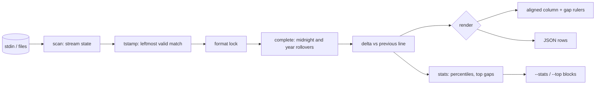

# gapline

[English](README.md) | [中文](README.zh.md) | [日本語](README.ja.md)

[](LICENSE) [](go.mod) [](CHANGELOG.md)  [](CONTRIBUTING.md)

**gapline：一个开源、零依赖的管道过滤器，把任意日志流里的时间空洞高亮出来 —— 时间戳格式自动检测加相对间隔渲染，让你立刻看清那四秒钟去哪儿了。**


```bash
git clone https://github.com/JaydenCJ/gapline && cd gapline
go build -o gapline ./cmd/gapline    # single static binary, stdlib only
```

> 预发布：v0.1.0 尚未发布到任何包仓库；请按上述方式从源码构建（任意 Go ≥1.22 即可）。

## 为什么选 gapline？

性能排障从盯着时间戳开始：两行日志相隔 25ms，接着两行相隔 4 秒，整个事故就藏在你脑子里一遍遍做的那道减法里。而现有工具在最需要的那一刻帮不上忙。`lnav` 是个能干的日志*浏览器*，但它是需要安装、配置、逐屏操作的全屏 TUI —— 不是凌晨两点管道炸了时能直接接在 `kubectl logs -f` 后面的东西。moreutils 的 `ts -i` 会打印行间间隔，可那是*到达*时间的间隔：只能在线用，量的是你的终端而不是应用本身，对昨晚事故留在文件里的时间戳一无所知。gapline 补上了中间这块：一个管道过滤器，自动检测流用的是九种时间戳格式中的哪一种（带日历校验，工单号不会被当成时间），给每一行加上与上一行的间隔前缀，并在每个空洞处画一条标尺 —— 实时流和事后文件都能用，想看汇总而不是滚屏时还有分位数和 top-N 空洞报告。

| | gapline | lnav | ts -i (moreutils) | awk + 心算 |
|---|---|---|---|---|
| 解析日志自带的时间戳 | ✅ 9 种格式，带校验 | ✅ | ❌ 只有到达时间 | 正则你自己写 |
| 行内相对间隔 + 空洞标尺 | ✅ | ❌ 浏览式查看 | 有间隔，无标尺 | ❌ |
| 事故之后对着存档文件用 | ✅ | ✅ | ❌ 只能在线 | ✅ |
| 纯管道过滤器（`tail -f`、`kubectl logs`、CI） | ✅ | ❌ 全屏 TUI | ✅ | ✅ |
| 不完整时间戳的跨午夜 / 跨年补全 | ✅ 确定性 | ✅ | n/a | ❌ |
| 分位数 + top-N 空洞 + JSON 行 | ✅ | 部分 | ❌ | ❌ |
| 运行时依赖 | 0 | ncurses、sqlite3、pcre2 等 | perl | 0 |

<sub>依赖数核查于 2026-07-13：gapline 只导入 Go 标准库；lnav 0.12 链接 ncurses、sqlite3、pcre2、libarchive 等。</sub>

## 特性

- **九种格式自动检测** —— RFC 3339（点/逗号小数、任意时区偏移）、Python logging 的 ISO、Go `log`、Apache/nginx CLF、syslog、glog/klog、dmesg、10/13/16/19 位 epoch、纯钟面时刻。最左侧的有效匹配获胜；流会锁定格式，正文里引用的时间不会让检测来回抖动。
- **日历校验的匹配** —— 13 月、25 时以及 2000-2099 之外的 epoch 会被拒绝并继续向后扫描，工单号、请求 ID 永远不会变成时间戳。
- **确定性的翻转补全** —— 无年份的 syslog 跨年、纯钟面时刻跨午夜，都只凭流内顺序正确补全；gapline 从不读取系统时钟，相同输入必然产生逐字节相同的输出。
- **诚实的负值** —— 小幅回跳（交错写入、时钟偏移）以青色负间隔原样呈现，而不是被"修正"掉。
- **真正的过滤器** —— 各行不缓冲地流过，间隔列对齐；无时间戳的续行（堆栈）留空直通；接 `tail -f` 和翻昨天的事故文件同样好使。
- **需要时才给汇总** —— `--stats` 打印 p50/p90/p99、跨度和空洞合计；`--top n` 引用最大的 n 个空洞及其行号；`--json` 每行输出一条机器可读记录，方便做 CI 闸门。
- **零依赖、完全离线** —— 只用 Go 标准库，无遥测、无网络，永远如此；`go.mod` 的 require 列表为空并将保持为空。

## 快速上手

```bash
gapline -t 1s examples/api-server.log        # or: kubectl logs api | gapline -t 1s
```

真实捕获的输出：

```text
     +0s │ 2026-07-12T14:03:22.120Z INFO  http GET /api/users 200 12ms
 +25.0ms │ 2026-07-12T14:03:22.145Z INFO  http GET /api/orders 200 9ms
 +16.0ms │ 2026-07-12T14:03:22.161Z INFO  cache hit users:list
 +29.0ms │ 2026-07-12T14:03:22.190Z INFO  http GET /api/accounts/9 200 4ms
 +24.0ms │ 2026-07-12T14:03:22.214Z INFO  http POST /api/login 201 22ms
──── gap 1.316s ──────────────────────────────
 +1.316s │ 2026-07-12T14:03:23.530Z WARN  pool connection pool exhausted, waiting
 +12.0ms │ 2026-07-12T14:03:23.542Z INFO  http GET /api/health 200 1ms
 +19.0ms │ 2026-07-12T14:03:23.561Z INFO  http GET /api/orders 200 8ms
──── gap 4.020s ──────────────────────────────
 +4.020s │ 2026-07-12T14:03:27.581Z ERROR upstream billing-svc timed out after 4s
         │   retrying with backoff (attempt 1/3)
 +31.0ms │ 2026-07-12T14:03:27.612Z INFO  http POST /api/checkout 502 4031ms
 +18.0ms │ 2026-07-12T14:03:27.630Z INFO  http GET /api/users 200 11ms
 +25.0ms │ 2026-07-12T14:03:27.655Z INFO  http GET /api/orders 200 7ms
```

还可以追加汇总 —— `gapline -t 1s --stats --top 2 examples/api-server.log` 会在上面的流之后附上这些块（真实输出的汇总部分）：

```text
── top 2 gaps ────────────────────────────────
 +4.020s  line 9      2026-07-12T14:03:27.581Z ERROR upstream billing-svc timed o…
 +1.316s  line 6      2026-07-12T14:03:23.530Z WARN  pool connection pool exhaust…
── gapline stats ─────────────────────────────
lines            13 (12 timestamped, 1 without)
format           rfc3339
span             5.535s
p50 / p90 / p99  25.0ms / 1.316s / 4.020s
max delta        +4.020s (line 9)
gaps ≥ 1.000s    2 (total 5.336s)
```

无年份的 syslog 在跨年夜跨过午夜 —— 翻转完全从流内顺序推断（`gapline -t 10s examples/worker-restart.log`，真实输出）：

```text
     +0s │ Dec 31 23:59:55 host worker[212]: draining queue (3 jobs left)
 +3.000s │ Dec 31 23:59:58 host worker[212]: queue empty, checkpointing
──── gap 33.0s ───────────────────────────────
  +33.0s │ Jan  1 00:00:31 host worker[212]: checkpoint complete
 +1.000s │ Jan  1 00:00:32 host systemd[1]: worker.service: scheduled restart
 +1.000s │ Jan  1 00:00:33 host worker[213]: started, resuming from checkpoint
```

## 时间戳格式

检测采用最左匹配 + 日历校验 + 按流锁定 —— 完整契约见 [docs/formats.md](docs/formats.md)。

| 格式 | 示例 | 说明 |
|---|---|---|
| `rfc3339` | `2026-07-12T14:03:22.123Z` | ISO 8601；`.`/`,` 小数，可带时区偏移 |
| `iso-space` | `2026-07-12 14:03:22,123` | Python `logging` 默认格式 |
| `slash` | `2026/07/12 14:03:22` | Go 标准库 `log` 默认格式 |
| `clf` | `[12/Jul/2026:14:03:22 +0900]` | Apache / nginx 访问日志 |
| `syslog` | `Jul 12 14:03:22` | RFC 3164；无年份，翻转自动推断 |
| `klog` | `I0712 14:03:22.123456` | glog / klog 头部；无年份 |
| `dmesg` | `[   12.345678]` | 内核开机秒数 |
| `epoch` | `1752328402.123` | 10/13/16/19 位 = 秒/毫秒/微秒/纳秒；带范围守卫 |
| `time-only` | `14:03:22.123` | 纯钟面时刻；跨午夜自动推断 |

## CLI 参考

`gapline [flags] [file ...]` —— 不给文件时读 stdin（`-` 也表示 stdin）。退出码：0 正常，1 未检测到时间戳，2 用法或 I/O 错误。

| 参数 | 默认值 | 作用 |
|---|---|---|
| `-t, --threshold` | `1s` | 达到该值的间隔画空洞标尺并标红 |
| `-f, --format` | 自动检测 | 强制指定时间戳格式（见 `--list-formats`） |
| `-s, --since-start` | 关 | 改为显示自首个时间戳以来的累计耗时 |
| `-b, --bars` | 关 | 按 1-2-5 阶梯的对数刻度条形列 |
| `--top` | 关 | 流结束后打印最大的 n 个空洞 |
| `--stats` | 关 | 流结束后打印 p50/p90/p99、跨度、空洞合计 |
| `--no-markers` | 关 | 不画空洞标尺线 |
| `--json` | 关 | 每行输入输出一条 JSON（`ts`、`delta_ms`、`gap` 等） |
| `--color` | `auto` | `always` / `never`；auto 只给 TTY 上色，遵守 `NO_COLOR` |
| `--list-formats` | — | 列出支持的时间戳格式并退出 |

## 验证

本仓库不带 CI；上面的每一条声明都由本地运行验证：

```bash
go test ./...            # 90 deterministic tests, offline, < 5 s
bash scripts/smoke.sh    # end-to-end CLI check, prints SMOKE OK
```

## 架构



## 路线图

- [x] v0.1.0 —— 九种自动检测格式（含校验与锁定）、带空洞标尺的间隔列、确定性翻转补全、`--stats`/`--top`/`--json`/`--bars`/`--since-start`、90 个测试 + 冒烟脚本
- [ ] `--only-gaps` 模式：只打印空洞及前后 n 行上下文
- [ ] 依据流自身的间隔分布自动确定阈值
- [ ] 12 小时制（`AM`/`PM`）与本地化月份名
- [ ] 多写入者模式：按字段（pid、pod）分轨计算间隔
- [ ] 在 `--stats` 里加间隔分布的直方图 sparkline

完整列表见 [open issues](https://github.com/JaydenCJ/gapline/issues)。

## 贡献

欢迎 issue、讨论与 PR —— 本地流程（格式化、vet、测试、`SMOKE OK`）见 [CONTRIBUTING.md](CONTRIBUTING.md)。入门任务标注了 [good first issue](https://github.com/JaydenCJ/gapline/issues?q=is%3Aissue+is%3Aopen+label%3A%22good+first+issue%22)，设计讨论在 [Discussions](https://github.com/JaydenCJ/gapline/discussions)。

## 许可证

[MIT](LICENSE)
